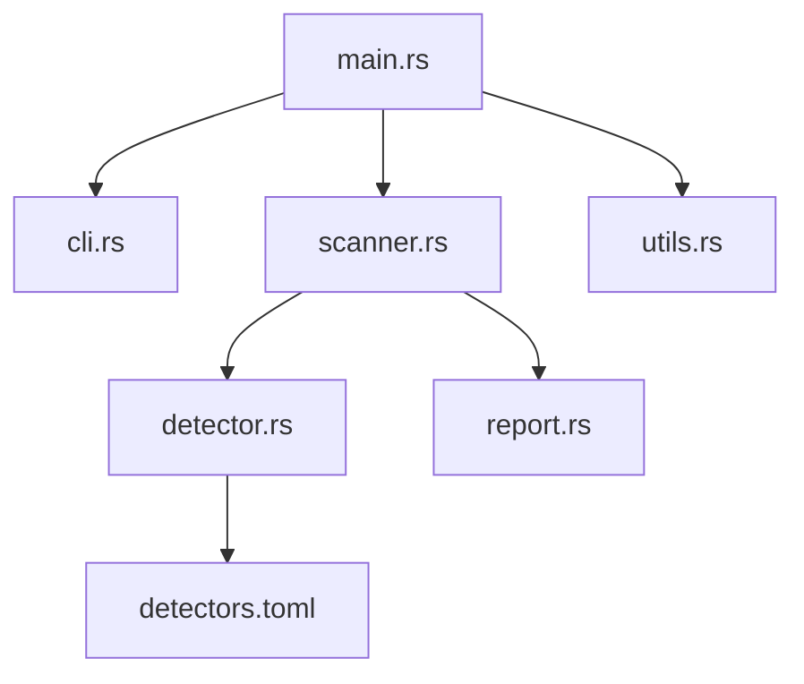

# KeyWatch

KeyWatch is a secret scanner written in Rust that analyzes files or directories for secrets such as API keys, passwords, tokens, and more. It leverages a flexible and configurable set of detectors (defined via a TOML configuration) to help you secure your codebase by catching accidental exposures early. Whether you’re integrating it into your CI/CD pipeline or using it as a pre-commit hook, KeyWatch is designed to be fast, efficient, and easily extendable.

## Table of Contents

- [Features](#features)
- [Project Structure](#project-structure)
- [Installation](#installation)
  - [Prerequisites](#prerequisites)
  - [Building from Source](#building-from-source)
  - [Installing the Binary](#installing-the-binary)
- [Usage](#usage)
  - [Scanning Files and Directories](#scanning-files-and-directories)
  - [Windows Users](#windows-users)
- [Adding More Detectors](#adding-more-detectors)
- [Integration with pre-commit](#integrating-keywatch-with-pre-commit)
- [Running Tests](#running-tests)
- [License](#license)

## Features

- **Recursive Scanning:** Easily scan a single file or an entire directory recursively to detect potential security breaches.
- **Comprehensive Detection:** The built-in detectors cover AWS keys, Google API keys, Slack tokens, JWT tokens, SSH keys, passwords, email addresses, IP addresses, and many more.
- **Configurable Detectors:** The detection logic is defined in [`detectors.toml`], which is simple to extend or customize according to your needs.
- **Output Options:** Generate JSON-formatted reports that can be directed to the console (in verbose mode) or saved to a file.
- **Integration Ready:** Designed to integrate with CI/CD pipelines, pre-commit hooks, or any other automated workflow.

## Project Structure

The KeyWatch project is organized as follows:

```txt
KeyWatch/
├── .gitignore               # Specifies intentionally untracked files to ignore.
├── Cargo.lock               # Cargo's lock file ensuring reproducible builds.
├── Cargo.toml               # Project manifest (dependencies, metadata, etc.)
├── LICENSE                  # MIT License file.
├── README.md                # This documentation file.
├── detectors.toml           # Configuration file defining secret detectors and regex patterns.
├── src
│   ├── cli.rs             // Contains CLI definitions using clap.
│   ├── detector.rs        // Implements secret detectors and regex patterns.
│   ├── lib.rs             // Re-exports modules for integration testing.
│   ├── main.rs            // Application entry point.
│   ├── report.rs          // Generates JSON reports from scan results.
│   ├── scanner.rs         // Implements file and directory scanning.
│   └── utils.rs           // Contains utility functions (e.g., file I/O).
└── tests
    └── integration_tests.rs  // Integration tests for end-to-end functionality.
```

The relationships between key modules are illustrated below:



## Installation

### Prerequisites

- [Rust](https://www.rust-lang.org/tools/install) (version 1.70 or later) must be installed on your system.
- Linux and macOS users: Standard Unix tools (`grep`, `chmod`, etc.) should be available.
- Windows users: Consider installing Git Bash or enabling Windows Subsystem for Linux (WSL2) for an enhanced Unix-like experience, though native Windows commands work as well.

### Building from Source

1. Clone the repository:

   ```sh
   git clone https://github.com/pixincreate/KeyWatch.git
   cd KeyWatch
   ```

2. Build the project using Cargo:

   ```sh
   cargo build
   ```

   This command compiles the KeyWatch binary into the `target/debug` directory.

### Installing the Binary

You can install KeyWatch globally so it is available from any command prompt:

1. **Cargo Install (Recommended):**

   Run the following command from the KeyWatch directory:

   ```sh
   cargo install --path .
   ```

> [!NOTE]
> This command copies the binary to Cargo’s bin directory (typically `~/.cargo/bin` on Unix or `%USERPROFILE%\.cargo\bin` on Windows), which should be part of your `PATH` already.
> This will let you invoke the binary simply by typing `key-watch`.

2. **Manual Installation:**

   You may manually copy the binary into a directory included in your PATH:

   - **For Unix-based systems (Linux/macOS):**

     ```sh
     cp target/debug/key-watch /usr/local/bin
     ```

     Or create a symbolic link:

     ```sh
     ln -s /path/to/target/release/key-watch /usr/local/bin/key-watch
     ```

   - **For Windows (PowerShell):**

     1. Navigate to the release directory:

        ```ps1
        cd target\release
        ```

     2. Copy the binary (e.g., `key-watch.exe`) to a directory that is part of your PATH (such as `C:\Program Files\KeyWatch`—ensure that directory is added to your PATH):

        ```ps1
        Copy-Item -Path "key-watch.exe" -Destination "C:\Program Files\KeyWatch\key-watch.exe"
        ```
        
        You can also add the `–Force` parameter if you want to overwrite the destination file without any prompts

     3. Alternatively, you can add `%USERPROFILE%\.cargo\bin` to your system `PATH` if it’s not already included. This is where Cargo installs binaries by default.

## Usage

### Scanning Files and Directories

After installing or building the binary, you can start scanning files for secrets:

- **Scanning a Single File (Output to Console):**

  ```sh
  cargo run -- --file ./path/to/your/file --verbose
  ```

  This command scans the specified file and prints a detailed JSON report to the console.

- **Recursively Scanning a Directory (Output to File):**

  ```sh
  cargo run -- --dir ./path/to/your/directory --output results.json
  ```

  The scanner will recursively inspect all eligible files within the directory tree, and the JSON report will be written to `results.json`.

### Windows Users

KeyWatch works well on Windows with a few adjustments:

- **Using Command Prompt or PowerShell:**
  The commands above work in either Command Prompt or PowerShell (preferred). Just ensure that Rust and Cargo are in your `PATH`, and that when installed via cargo, your binaries are located in `%USERPROFILE%\.cargo\bin`.

- **Windows Environment Tips:**

  - If using PowerShell, remember to escape arguments properly if needed.
  - For better Unix-like behavior, consider installing Git Bash which provides a more consistent experience with the documentation examples.
  - If integrating KeyWatch with Windows-based CI systems (e.g., Azure Pipelines), you may need to adjust the shell commands accordingly.

- **Running on Windows:**

  To run KeyWatch on a specific file from Command Prompt:

  ```cmd
  key-watch --file "C:\path\to\your\file" --verbose
  ```

  Or to scan a directory recursively:

  ```cmd
  key-watch --dir "C:\path\to\your\directory" --output "C:\path\to\results.json"
  ```

## Adding More Detectors

KeyWatch uses a flexible detector system configured via the [`detectors.toml`] file. You can modify this file to add new secret detectors or adjust the regular expressions and configurations of existing ones. For example:

- Open `detectors.toml` in your preferred editor.
- Define a new section with a unique identifier for your custom detector.
- Provide the regex patterns, severity levels, and any additional metadata necessary.

This design means you can continuously tailor KeyWatch to meet the needs of your security policies.

## Integrating KeyWatch with pre-commit

Integrate KeyWatch into your development workflow by setting it up as a pre-commit hook. This ensures that any secrets accidentally committed to your repository get caught immediately.

1. **Install pre-commit:**

   Ensure Python is installed on your system, then use pip:

   ```sh
   pip install pre-commit
   ```

> [!NOTE]
> Make sure that you have the `pre-commit` binary in your PATH.

2. **Create the Hook Script:**

   1. Make a hooks directory in your project root:

      ```sh
      mkdir -p hooks
      ```

   2. Create a file named `hooks/keywatch.sh` with the following content:

      ```sh
      #!/bin/sh

      EXIT_CODE=0
      for FILE in "$@"; do
        # Only scan text files
        if file "$FILE" | grep -q text; then
          echo "Scanning $FILE for secrets..."
          REPORT=$(key-watch --file "$FILE" --verbose)
          if echo "$REPORT" | grep -q '"status": "FAIL"'; then
            echo "Secret found in $FILE:"
            echo "$REPORT"
            EXIT_CODE=1
          fi
        fi
      done
      exit $EXIT_CODE
      ```

   3. Make the script executable:

      ```sh
      chmod +x hooks/keywatch.sh
      ```

3. **Configure pre-commit:**

   Create a `.pre-commit-config.yaml` file in your project root with these contents:

   ```yaml
   repos:
     - repo: local
       hooks:
         - id: keywatch
           name: KeyWatch Secret Scanner
           entry: ./hooks/keywatch.sh
           language: script
           files: .*\.(rs|txt|py|js)$ # Adjust the pattern as necessary
   ```

4. **Install the pre-commit Hooks:**

   Run the following command to install the hook into your local Git configuration:

   ```sh
   pre-commit install
   ```

5. **Test the Integration:**

   To see the hook in action, stage files with potential secrets and try committing:

   ```sh
   git add <file-with-secret>
   git commit -m "Test commit: should run secret scanner"
   ```

   If KeyWatch detects a secret, the commit will be blocked with a detailed error message. Correct the issue (or update your detector configuration) and try committing again.

## Running Tests

KeyWatch comes with integration tests located in the `/tests` directory. To run all tests, execute:

```sh
cargo test
```

This command will run the complete suite of tests ensuring that the scanning and reporting components behave as expected.

## License

KeyWatch is distributed under the terms of the [MIT License](LICENSE), which means you’re free to use and modify the software as long as the license terms are met.
