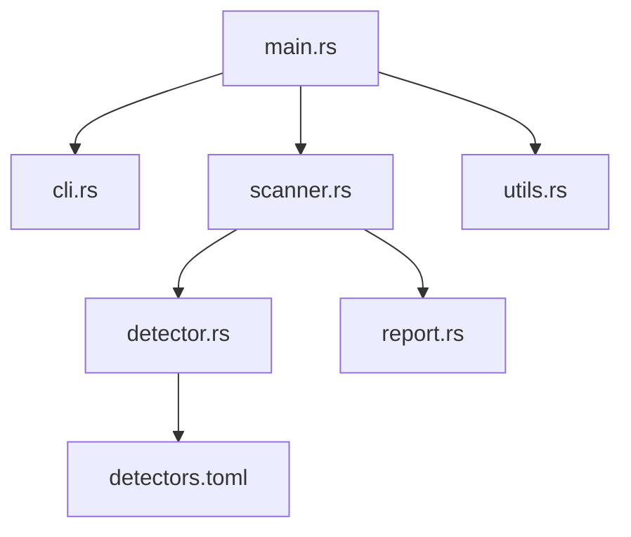

# KeyWatch

KeyWatch is a secret scanner written in Rust that analyzes files or directories for secrets such as API keys, passwords, tokens, and more. It leverages a flexible and configurable set of detectors (defined via a TOML configuration) to help you secure your codebase by catching accidental exposures early. Whether you’re integrating it into your CI/CD pipeline or using it as a pre-commit hook, KeyWatch is designed to be fast, efficient, and easily extendable.

## Table of Contents

- [Features](#features)
- [Project Structure](#project-structure)
- [Installation](#installation)
  - [Prerequisites](#prerequisites)
  - [Building from Source](#building-from-source)
  - [Installing the Binary](#installing-the-binary)
- [Usage](#usage)
  - [Basic Scanning](#basic-scanning)
  - [Repository Controls](#repository-controls)
  - [Path Exclusions](#path-exclusions)
  - [Exit Code Modes](#exit-code-modes)
  - [Binary Integrity Check](#binary-integrity-check)
  - [Installing Git Hooks](#installing-git-hooks)
- [Windows Users](#windows-users)
- [Adding More Detectors](#adding-more-detectors)
- [Running Tests](#running-tests)
- [License](#license)

## Features

- **Recursive Scanning:** Easily scan a single file or an entire directory recursively to detect potential security breaches.
- **Comprehensive Detection:** The built-in detectors cover AWS keys, Google API keys, Slack tokens, JWT tokens, SSH keys, passwords, email addresses, IP addresses, and many more.
- **Configurable Detectors:** The detection logic is defined in [`detectors.toml`], which is simple to extend or customize according to your needs.
- **Output Options:** Generate JSON-formatted reports that can be directed to the console (in verbose mode) or saved to a file.
- **Integration Ready:** Designed to integrate with CI/CD pipelines, pre-commit hooks, or any other automated workflow.
- **Repository Controls:** Whitelist allowed repos, block specific repos
- **Path Exclusions:** Exclude files/directories using glob patterns
- **Git Hook Installation:** Auto-install pre-push or pre-commit hooks
- **Exit Code Modes:** Configure exit behavior (always/critical/strict)
- **Binary Integrity Check:** Verify binary wasn't tampered with

## Project Structure

The KeyWatch project is organized as follows:

```txt
KeyWatch/
├── .gitignore               # Specifies intentionally untracked files to ignore.
├── Cargo.lock               # Cargo's lock file ensuring reproducible builds.
├── Cargo.toml               # Project manifest (dependencies, metadata, etc.)
├── LICENSE                  # MIT License file.
├── README.md                # This documentation file.
├── detectors.toml           # Configuration file defining secret detectors and regex patterns.
├── src
│   ├── cli.rs             // Contains CLI definitions using clap.
│   ├── detector.rs        // Implements secret detectors and regex patterns.
│   ├── lib.rs             // Re-exports modules for integration testing.
│   ├── main.rs            // Application entry point.
│   ├── report.rs          // Generates JSON reports from scan results.
│   ├── scanner.rs         // Implements file and directory scanning.
│   └── utils.rs           // Contains utility functions (e.g., file I/O).
└── tests
    └── integration_tests.rs  // Integration tests for end-to-end functionality.
```

The relationships between key modules are illustrated below:


```mermaid
graph TD
    A[main.rs] --> B[cli.rs]
    A --> C[scanner.rs]
    C --> D[detector.rs]
    D --> E[detectors.toml]
    C --> F[report.rs]
    A --> G[utils.rs]
```

## Installation

### Prerequisites

- [Rust](https://www.rust-lang.org/tools/install) (version 1.70 or later) must be installed on your system.
- Linux and macOS users: Standard Unix tools (`grep`, `chmod`, etc.) should be available.
- Windows users: Consider installing Git Bash or enabling Windows Subsystem for Linux (WSL2) for an enhanced Unix-like experience, though native Windows commands work as well.

### Building from Source

1. Clone the repository:

   ```sh
   git clone https://github.com/pixincreate/KeyWatch.git
   cd KeyWatch
   ```

2. Build the project using Cargo:

   ```sh
   cargo build
   ```

   This command compiles the KeyWatch binary into the `target/debug` directory.

### Installing the Binary

You can install KeyWatch globally so it is available from any command prompt:

1. **Cargo Install (Recommended):**

   Run the following command from the KeyWatch directory:

   ```sh
   cargo install --path .
   ```

> [!NOTE]
> This command copies the binary to Cargo’s bin directory (typically `~/.cargo/bin` on Unix or `%USERPROFILE%\.cargo\bin` on Windows), which should be part of your `PATH` already.
> This will let you invoke the binary simply by typing `key-watch`.

2. **Manual Installation:**

   You may manually copy the binary into a directory included in your PATH:

   - **For Unix-based systems (Linux/macOS):**

     ```sh
     cp target/debug/key-watch /usr/local/bin
     ```

     Or create a symbolic link:

     ```sh
     ln -s /path/to/target/release/key-watch /usr/local/bin/key-watch
     ```

   - **For Windows (PowerShell):**

     1. Navigate to the release directory:

        ```ps1
        cd target\release
        ```

     2. Copy the binary (e.g., `key-watch.exe`) to a directory that is part of your PATH (such as `C:\Program Files\KeyWatch`—ensure that directory is added to your PATH):

        ```ps1
        Copy-Item -Path "key-watch.exe" -Destination "C:\Program Files\KeyWatch\key-watch.exe"
        ```
        
        You can also add the `–Force` parameter if you want to overwrite the destination file without any prompts

     3. Alternatively, you can add `%USERPROFILE%\.cargo\bin` to your system `PATH` if it’s not already included. This is where Cargo installs binaries by default.

## Usage

### Basic Scanning

After installing or building the binary, you can start scanning files for secrets:

```sh
# Scan a single file
key-watch --file ./path/to/file

# Scan a directory recursively
key-watch --dir ./path/to/directory

# Output to console (verbose)
key-watch --dir ./path --verbose

# Output to file
key-watch --dir ./path --output results.json
```

### Repository Controls

> ⚠️ **Note:** Repository controls are currently experimental. These flags are parsed and stored, but full runtime enforcement against remote URLs is not yet implemented.

Control which repositories are allowed or blocked (for future enforcement):

```sh
# Allow only specific repos (comma-separated)
key-watch --dir . --allowed-repos "github.com/company,gitlab.com/company"

# Block specific repos
key-watch --dir . --blocked-repos "github.com/personal"
```

### Path Exclusions

Exclude files or directories using glob patterns (comma-separated):

```sh
key-watch --dir . --exclude "*.log,tests/*,docs/**,node_modules/**"
```

> ⚠️ **Limitation:** Directory scanning requires UTF-8 encoded text files. Binary files will cause scan failures.

### Exit Code Modes

Configure exit behavior:

```sh
# strict (default): Exit non-zero for any finding
key-watch --dir . --exit-mode strict

# critical: Exit 0 if only LOW/MEDIUM severity
key-watch --dir . --exit-mode critical

# always: Always exit 0 (bypass)
key-watch --dir . --exit-mode always
```

### Binary Integrity Check

Verify the binary hasn't been tampered with:

```sh
key-watch --verify-integrity
```

### Installing Git Hooks

Auto-install KeyWatch as a git hook:

```sh
# Install pre-push hook (runs before push)
key-watch --install-hook pre-push

# Install pre-commit hook (runs before commit)
key-watch --install-hook pre-commit
```

> ⚠️ **Important:** Generated hooks depend on `key-watch` being available on your `PATH`. Ensure the binary is installed and accessible before using hooks.
>
> The hook will run automatically on git commands after installation.

### Windows Users

KeyWatch works well on Windows with a few adjustments:

- **Using Command Prompt or PowerShell:**
  The commands above work in either Command Prompt or PowerShell (preferred). Just ensure that Rust and Cargo are in your `PATH`, and that when installed via cargo, your binaries are located in `%USERPROFILE%\.cargo\bin`.

- **Windows Environment Tips:**

  - If using PowerShell, remember to escape arguments properly if needed.
  - For better Unix-like behavior, consider installing Git Bash which provides a more consistent experience with the documentation examples.
  - If integrating KeyWatch with Windows-based CI systems (e.g., Azure Pipelines), you may need to adjust the shell commands accordingly.

- **Running on Windows:**

  To run KeyWatch on a specific file from Command Prompt:

  ```cmd
  key-watch --file "C:\path\to\your\file" --verbose
  ```

  Or to scan a directory recursively:

  ```cmd
  key-watch --dir "C:\path\to\your\directory" --output "C:\path\to\results.json"
  ```

## Adding More Detectors

KeyWatch uses a flexible detector system configured via the [`detectors.toml`] file. You can modify this file to add new secret detectors or adjust the regular expressions and configurations of existing ones. For example:

- Open `detectors.toml` in your preferred editor.
- Define a new section with a unique identifier for your custom detector.
- Provide the regex patterns, severity levels, and any additional metadata necessary.

This design means you can continuously tailor KeyWatch to meet the needs of your security policies.

## CLI Options Reference

| Option | Description | Example |
|--------|-------------|---------|
| `--file` | Scan a single file | `--file config.toml` |
| `--dir` | Scan a directory | `--dir ./src` |
| `--output` | Save output to file | `--output results.json` |
| `--verbose` | Print to console | `--verbose` |
| `--allowed-repos` | Whitelist repos | `--allowed-repos github.com/company` |
| `--blocked-repos` | Block repos | `--blocked-repos github.com/personal` |
| `--exclude` | Exclude paths (glob) | `--exclude "*.log,node_modules/**"` |
| `--install-hook` | Install git hook | `--install-hook pre-push` |
| `--exit-mode` | Exit behavior | `--exit-mode critical` |
| `--verify-integrity` | Check binary integrity | `--verify-integrity` |

## Running Tests

KeyWatch comes with integration tests located in the `/tests` directory. To run all tests, execute:

```sh
cargo test
```

This command will run the complete suite of tests ensuring that the scanning and reporting components behave as expected.

## License

KeyWatch is distributed under the terms of the [MIT License](LICENSE), which means you’re free to use and modify the software as long as the license terms are met.
