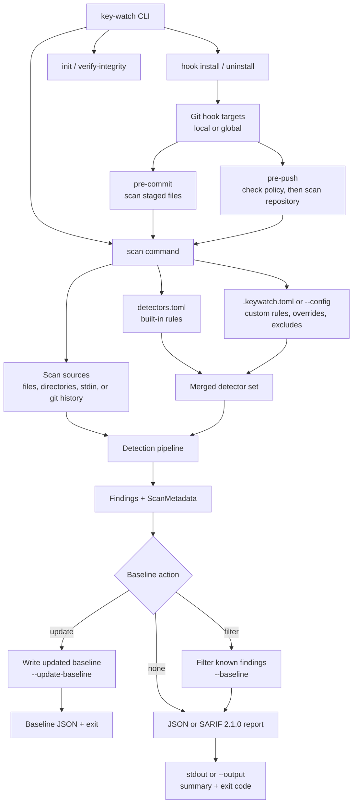
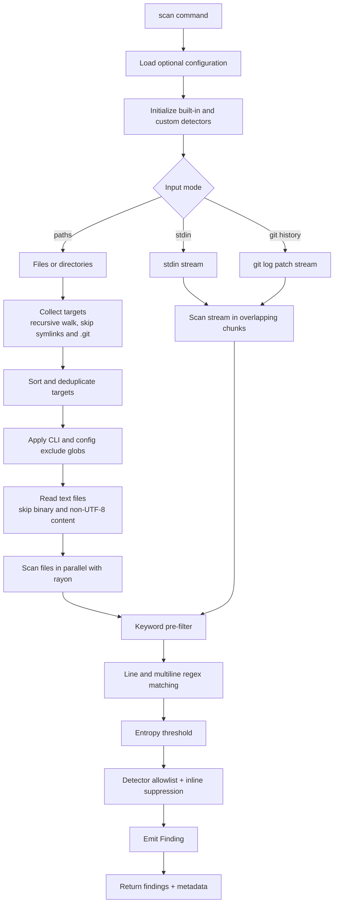

# KeyWatch

A fast secret scanner for files and directories.

## Install

### Recommended: cargo install

```sh
cargo install key-watch
key-watch --version

# Enable aliases for your current shell session
eval "$(key-watch init bash)"
```

To make aliases persistent, add the init line to your shell config file:

```sh
# bash
echo 'eval "$(key-watch init bash)"' >> ~/.bashrc

# zsh
echo 'eval "$(key-watch init zsh)"' >> ~/.zshrc
```

### Manual install from GitHub Releases

1. Download the correct binary for your OS/architecture from GitHub Releases.
2. Move it to a directory on your `PATH`, for example `~/.local/bin`.
3. Make it executable.
4. Verify it runs.
5. Enable aliases with `init`.

```sh
mkdir -p ~/.local/bin
mv ~/Downloads/key-watch ~/.local/bin/key-watch
chmod +x ~/.local/bin/key-watch
~/.local/bin/key-watch --version

# Enable aliases for current shell session
eval "$(~/.local/bin/key-watch init bash)"
```

Requires Rust 1.85+ (edition 2024) when building from source.

The canonical command is `key-watch`.
`keywatch` and `kw` are optional shell aliases exposed via `key-watch init ...`.

## Uninstall

### If installed with `cargo install`

```sh
cargo uninstall key-watch
```

If you added aliases to your shell config, remove the init line you added earlier, for example:

```sh
# bash
sed -i.bak '/key-watch init bash/d' ~/.bashrc

# zsh
sed -i.bak '/key-watch init zsh/d' ~/.zshrc
```

### If installed manually from GitHub Releases

1. Remove the `key-watch` binary from your `PATH` directory.
2. Remove any shell init line you added for aliases.
3. Restart your shell or reload your shell config.

```sh
rm -f ~/.local/bin/key-watch

# If you added aliases for the current shell config, remove that line manually
# then reload your shell config, for example:
source ~/.bashrc
```

## Usage

```sh
# Scan a file
key-watch scan secrets.txt

# Scan a directory
key-watch scan .

# Scan from stdin
cat secrets.txt | key-watch scan --stdin

# Scan git history for committed secrets
key-watch scan --git-history

# Verbose output (JSON)
key-watch scan secrets.txt --verbose

# Install git hook
key-watch hook install pre-commit
key-watch hook install pre-push

# Remove git hook
key-watch hook uninstall pre-commit
key-watch hook uninstall pre-push

# Install git hook globally via core.hooksPath
key-watch hook install pre-commit --global
key-watch hook install pre-push --global

# Remove global hook
key-watch hook uninstall pre-commit --global
key-watch hook uninstall pre-push --global

# Print shell aliases
eval "$(key-watch init bash)"

# Verify binary integrity
key-watch verify-integrity
```

## Options

- `scan <path>...` - Scan one or more files or directories
- `scan --config <path>` - Load configuration from an explicit `.keywatch.toml` path
- `scan --no-config-discovery` - Ignore discovered repository config unless `--config` is explicit
- `scan --format <json|sarif>` - Choose the report format written to stdout or the output file
- `scan --stdin` - Read content from stdin instead of files
- `scan --git-history` - Scan git history (`git log -p`) for committed secrets
- `scan --output <path>` - Save report to file
- `scan --verbose` - Print full JSON output
- `scan --exclude <patterns>` - Comma-separated glob patterns to exclude
- `scan --exit-mode <mode>` - Exit behavior: `always` (always pass), `critical` (fail on HIGH/CRITICAL only), `strict` (fail on any finding, default)
- `scan --baseline <path>` - Suppress known findings from a previous scan
- `scan --update-baseline` - Update baseline with current findings (requires `--baseline`)
- `hook install <pre-commit|pre-push> [--global]` - Install a git hook
- `hook uninstall <pre-commit|pre-push> [--global]` - Remove a git hook
- `hook install pre-push --allowed-repos <urls>` - Whitelist repos for pre-push hooks
- `hook install pre-push --blocked-repos <urls>` - Block repos for pre-push hooks
- `hook install pre-commit --exclude <patterns>` - Exclude patterns for pre-commit scans
- `init <shell>` - Print shell aliases for `keywatch` and `kw`
- `verify-integrity` - Check binary hasn't been tampered with

## Aliases

- `key-watch` is the only shipped binary.
- `keywatch` and `kw` are optional aliases.
- `key-watch init bash|zsh|fish|posix` prints shell aliases you can eval in your shell.
- `watch` is intentionally not used, to avoid colliding with the standard Unix `watch` command.

## Baseline

Use baselines to suppress known findings on subsequent scans:

```sh
# First scan: create a baseline
key-watch scan . --baseline .keywatch.baseline --update-baseline

# Future scans: only report NEW findings
key-watch scan . --baseline .keywatch.baseline
```

## Inline Suppression

Add `keywatch:ignore` to suppress a finding on a specific line:

```sh
password = 'known-test-password' # keywatch:ignore
```

## Exit Codes

| Code | Meaning                                         |
| ---- | ----------------------------------------------- |
| 0    | No secrets found (or `scan --exit-mode always`) |
| 1    | Secret found (in strict/critical mode)          |
| 2    | Runtime/configuration error                     |

## Default Behavior

- **Repos**: All allowed (no restrictions)
- **Exit mode**: strict (fail on any finding)

## Git Hooks

- `hook install pre-commit|pre-push` installs a repo-local hook into `.git/hooks/`
- `hook uninstall pre-commit|pre-push` removes a KeyWatch hook from the same target
- `hook install ... --global` installs into Git's global hooks directory
- `hook uninstall ... --global` removes the hook from Git's global hooks directory
- Local hook paths are resolved via `git rev-parse --git-path hooks`, so installs work in worktrees and submodules too
- If `core.hooksPath` is already configured, KeyWatch installs into that directory
- Otherwise KeyWatch creates a managed hooks directory and configures `git config --global core.hooksPath`
- KeyWatch refuses to overwrite a non-KeyWatch global hook file
- KeyWatch also refuses to remove a non-KeyWatch global hook file

## Architecture

### System Overview


```mermaid
flowchart TD
    CLI["key-watch CLI"]
    Scan["scan command"]
    Hooks["hook install / uninstall"]
    Setup["init / verify-integrity"]

    Sources["Scan sources<br/>files, directories, stdin, or git history"]
    BuiltIns["detectors.toml<br/>built-in rules"]
    UserConfig[".keywatch.toml or --config<br/>custom rules, overrides, excludes"]
    Detectors["Merged detector set"]
    Pipeline["Detection pipeline"]
    Findings["Findings + ScanMetadata"]
    BaselineAction{"Baseline action"}
    BaselineFilter["Filter known findings<br/>--baseline"]
    BaselineUpdate["Write updated baseline<br/>--update-baseline"]
    BaselineFile["Baseline JSON + exit"]
    Report["JSON or SARIF 2.1.0 report"]
    Destination["stdout or --output<br/>summary + exit code"]

    HookTargets["Git hook targets<br/>local or global"]
    PreCommit["pre-commit<br/>scan staged files"]
    PrePush["pre-push<br/>check policy, then scan repository"]

    CLI --> Scan
    CLI --> Hooks
    CLI --> Setup

    Hooks --> HookTargets
    HookTargets --> PreCommit
    HookTargets --> PrePush
    PreCommit --> Scan
    PrePush --> Scan

    Scan --> Sources
    Scan --> BuiltIns
    Scan --> UserConfig
    BuiltIns --> Detectors
    UserConfig --> Detectors
    Sources --> Pipeline
    Detectors --> Pipeline
    Pipeline --> Findings
    Findings --> BaselineAction
    BaselineAction -->|none| Report
    BaselineAction -->|filter| BaselineFilter
    BaselineAction -->|update| BaselineUpdate
    BaselineFilter --> Report
    BaselineUpdate --> BaselineFile
    Report --> Destination
```

### Architecture Overview

KeyWatch is organized into five layers. Data flows top to bottom: input sources and configuration feed the detection pipeline, findings pass through post-processing, and results are serialized to stdout or a file.

1. **Input** — the CLI accepts files, directories, stdin, or git history (`--git-history`). Flags control exclusion (`--exclude`), baselineing (`--baseline`, `--update-baseline`), output format (`--format`), config path (`--config`), and exit behavior (`--exit-mode`).
2. **Configuration** — `detectors.toml` ships with the binary and holds the built-in rules. An optional `.keywatch.toml` adds custom rules, per-detector severity/enable overrides, and exclude patterns. Configuration merges — it never replaces defaults.
3. **Detection pipeline** — six stages run per file: collect files (recursive walk, skipping `.git` and binary files), apply exclude globs, pre-filter by keyword (fast path that avoids regex on irrelevant files), match regexes (single-line and multiline `(?s)`), gate on Shannon entropy, and apply allowlists plus inline `keywatch:ignore` suppression. Files are scanned in parallel with rayon.
4. **Post-processing** — an optional baseline filter suppresses findings already recorded in the baseline file, keyed by a salted SHA-256 fingerprint of the matched content.
5. **Output** — findings serialize as JSON or SARIF 2.1.0 and are written to stdout or an output file, followed by a severity summary and an exit code derived from the exit mode.

### Detection Pipeline


```mermaid
flowchart TD
    Start["scan command"]
    Config["Load optional configuration"]
    Detectors["Initialize built-in and custom detectors"]
    Mode{"Input mode"}

    Paths["Files or directories"]
    Stdin["stdin stream"]
    History["git log patch stream"]

    Collect["Collect targets<br/>recursive walk, skip symlinks and .git"]
    Dedupe["Sort and deduplicate targets"]
    Exclude["Apply CLI and config exclude globs"]
    Read["Read text files<br/>skip binary and non-UTF-8 content"]
    Parallel["Scan files in parallel with rayon"]
    Stream["Scan stream in overlapping chunks"]

    Keyword["Keyword pre-filter"]
    Regex["Line and multiline regex matching"]
    Entropy["Entropy threshold"]
    Suppress["Detector allowlist + inline suppression"]
    Emit["Emit Finding"]
    Result["Return findings + metadata"]

    Start --> Config --> Detectors --> Mode
    Mode -->|paths| Paths
    Mode -->|stdin| Stdin
    Mode -->|git history| History

    Paths --> Collect --> Dedupe --> Exclude --> Read --> Parallel
    Stdin --> Stream
    History --> Stream

    Parallel --> Keyword
    Stream --> Keyword
    Keyword --> Regex --> Entropy --> Suppress --> Emit --> Result
```

### Core Data Types

- **Detector** — a named rule: regex, finding type, severity, optional keywords for pre-filtering, an entropy threshold, and an allowlist.
- **Finding** — one detected secret: file path, line number, finding type, severity, matched content, and the detector that produced it.
- **Severity** — `Critical`, `High`, `Medium`, `Low`.
- **KeywatchConfig** — parsed `.keywatch.toml`: custom rules, per-detector overrides, and exclude patterns.
- **Baseline** — versioned collection of fingerprint entries; filters out already-known findings.
- **ScanMetadata** — files scanned, total lines, and excluded files, reported alongside findings.

## Development

```sh
cargo build --release
cargo test
cargo fmt
cargo clippy
```
