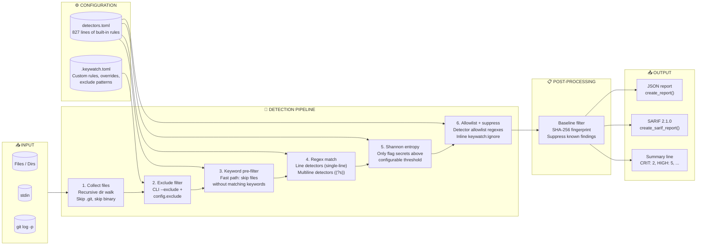
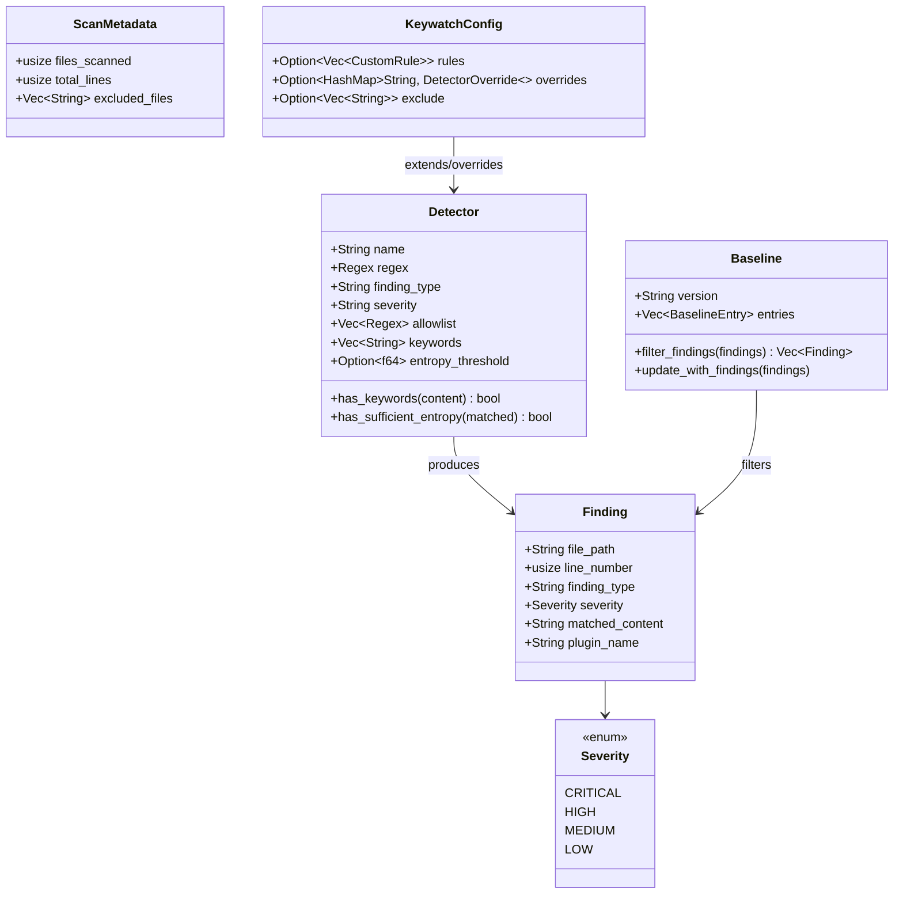

# KeyWatch

A fast secret scanner for files and directories.

## Install

### Recommended: cargo install

```sh
cargo install key-watch
key-watch --version

# Enable aliases for your current shell session
eval "$(key-watch init bash)"
```

To make aliases persistent, add the init line to your shell config file:

```sh
# bash
echo 'eval "$(key-watch init bash)"' >> ~/.bashrc

# zsh
echo 'eval "$(key-watch init zsh)"' >> ~/.zshrc
```

### Manual install from GitHub Releases

1. Download the correct binary for your OS/architecture from GitHub Releases.
2. Move it to a directory on your `PATH`, for example `~/.local/bin`.
3. Make it executable.
4. Verify it runs.
5. Enable aliases with `init`.

```sh
mkdir -p ~/.local/bin
mv ~/Downloads/key-watch ~/.local/bin/key-watch
chmod +x ~/.local/bin/key-watch
~/.local/bin/key-watch --version

# Enable aliases for current shell session
eval "$(~/.local/bin/key-watch init bash)"
```

Requires Rust 1.85+ (edition 2024) when building from source.

The canonical command is `key-watch`.
`keywatch` and `kw` are optional shell aliases exposed via `key-watch init ...`.

## Uninstall

### If installed with `cargo install`

```sh
cargo uninstall key-watch
```

If you added aliases to your shell config, remove the init line you added earlier, for example:

```sh
# bash
sed -i.bak '/key-watch init bash/d' ~/.bashrc

# zsh
sed -i.bak '/key-watch init zsh/d' ~/.zshrc
```

### If installed manually from GitHub Releases

1. Remove the `key-watch` binary from your `PATH` directory.
2. Remove any shell init line you added for aliases.
3. Restart your shell or reload your shell config.

```sh
rm -f ~/.local/bin/key-watch

# If you added aliases for the current shell config, remove that line manually
# then reload your shell config, for example:
source ~/.bashrc
```

## Usage

```sh
# Scan a file
key-watch scan secrets.txt

# Scan a directory
key-watch scan .

# Scan from stdin
cat secrets.txt | key-watch scan --stdin

# Scan git history for committed secrets
key-watch scan --git-history

# Verbose output (JSON)
key-watch scan secrets.txt --verbose

# Install git hook
key-watch hook install pre-commit
key-watch hook install pre-push

# Remove git hook
key-watch hook uninstall pre-commit
key-watch hook uninstall pre-push

# Install git hook globally via core.hooksPath
key-watch hook install pre-commit --global
key-watch hook install pre-push --global

# Remove global hook
key-watch hook uninstall pre-commit --global
key-watch hook uninstall pre-push --global

# Print shell aliases
eval "$(key-watch init bash)"

# Verify binary integrity
key-watch verify-integrity
```

## Options

- `scan <path>...` - Scan one or more files or directories
- `scan --stdin` - Read content from stdin instead of files
- `scan --git-history` - Scan git history (`git log -p`) for committed secrets
- `scan --output <path>` - Save report to file
- `scan --verbose` - Print full JSON output
- `scan --exclude <patterns>` - Comma-separated glob patterns to exclude
- `scan --exit-mode <mode>` - Exit behavior: `always` (always pass), `critical` (fail on HIGH/CRITICAL only), `strict` (fail on any finding, default)
- `scan --baseline <path>` - Suppress known findings from a previous scan
- `scan --update-baseline` - Update baseline with current findings (requires `--baseline`)
- `hook install <pre-commit|pre-push> [--global]` - Install a git hook
- `hook uninstall <pre-commit|pre-push> [--global]` - Remove a git hook
- `hook install pre-push --allowed-repos <urls>` - Whitelist repos for pre-push hooks
- `hook install pre-push --blocked-repos <urls>` - Block repos for pre-push hooks
- `hook install pre-commit --exclude <patterns>` - Exclude patterns for pre-commit scans
- `init <shell>` - Print shell aliases for `keywatch` and `kw`
- `verify-integrity` - Check binary hasn't been tampered with

## Aliases

- `key-watch` is the only shipped binary.
- `keywatch` and `kw` are optional aliases.
- `key-watch init bash|zsh|fish|posix` prints shell aliases you can eval in your shell.
- `watch` is intentionally not used, to avoid colliding with the standard Unix `watch` command.

## Baseline

Use baselines to suppress known findings on subsequent scans:

```sh
# First scan: create a baseline
key-watch scan . --baseline .keywatch.baseline --update-baseline

# Future scans: only report NEW findings
key-watch scan . --baseline .keywatch.baseline
```

## Inline Suppression

Add `keywatch:ignore` to suppress a finding on a specific line:

```sh
password = 'known-test-password' # keywatch:ignore
```

## Exit Codes

| Code | Meaning                                         |
| ---- | ----------------------------------------------- |
| 0    | No secrets found (or `scan --exit-mode always`) |
| 1    | Secret found (in strict/critical mode)          |
| 2    | Runtime/configuration error                     |

## Default Behavior

- **Repos**: All allowed (no restrictions)
- **Exit mode**: strict (fail on any finding)

## Git Hooks

- `hook install pre-commit|pre-push` installs a repo-local hook into `.git/hooks/`
- `hook uninstall pre-commit|pre-push` removes a KeyWatch hook from the same target
- `hook install ... --global` installs into Git's global hooks directory
- `hook uninstall ... --global` removes the hook from Git's global hooks directory
- Local hook paths are resolved via `git rev-parse --git-path hooks`, so installs work in worktrees and submodules too
- If `core.hooksPath` is already configured, KeyWatch installs into that directory
- Otherwise KeyWatch creates a managed hooks directory and configures `git config --global core.hooksPath`
- KeyWatch refuses to overwrite a non-KeyWatch global hook file
- KeyWatch also refuses to remove a non-KeyWatch global hook file

## Architecture

### Layers & Data Flow


```mermaid
flowchart LR
    subgraph Input["📥 INPUT"]
        direction LR
        FILES[("Files / Dirs")]
        STDIN[("stdin")]
        GIT[("git log -p")]
    end

    subgraph Config["⚙️ CONFIGURATION"]
        DET_TOML[("detectors.toml<br/>827 lines of built-in rules")]
        KW_TOML[(".keywatch.toml<br/>Custom rules, overrides,<br/>exclude patterns")]
    end

    subgraph Pipeline["🔁 DETECTION PIPELINE"]
        direction TB
        COLLECT["1. Collect files<br/>Recursive dir walk<br/>Skip .git, skip binary"]
        EXCLUDE["2. Exclude filter<br/>CLI --exclude +<br/>config.exclude"]
        KEYWORD["3. Keyword pre-filter<br/>Fast path: skip files<br/>without matching keywords"]
        REGEX["4. Regex match<br/>Line detectors (single-line)<br/>Multiline detectors ((?s))"]
        ENTROPY["5. Shannon entropy<br/>Only flag secrets above<br/>configurable threshold"]
        ALLOW["6. Allowlist + suppress<br/>Detector allowlist regexes<br/>Inline keywatch:ignore"]
    end

    subgraph Post["📋 POST-PROCESSING"]
        BASELINE["Baseline filter<br/>SHA-256 fingerprint<br/>Suppress known findings"]
    end

    subgraph Output["📤 OUTPUT"]
        JSON_OUT["JSON report<br/>create_report()"]
        SARIF_OUT["SARIF 2.1.0<br/>create_sarif_report()"]
        SUMMARY["Summary line<br/>CRIT: 2, HIGH: 5, ..."]
    end

    Input --> COLLECT
    DET_TOML --> KEYWORD
    DET_TOML --> REGEX
    DET_TOML --> ENTROPY
    DET_TOML --> ALLOW
    KW_TOML --> EXCLUDE
    COLLECT --> EXCLUDE
    EXCLUDE --> KEYWORD --> REGEX --> ENTROPY --> ALLOW
    ALLOW --> BASELINE
    BASELINE --> JSON_OUT
    BASELINE --> SARIF_OUT
    BASELINE --> SUMMARY
```

### Core Data Types


```mermaid
classDiagram
    class Detector {
        +String name
        +Regex regex
        +String finding_type
        +String severity
        +Vec~Regex~ allowlist
        +Vec~String~ keywords
        +Option~f64~ entropy_threshold
        +has_keywords(content) bool
        +has_sufficient_entropy(matched) bool
    }

    class Finding {
        +String file_path
        +usize line_number
        +String finding_type
        +Severity severity
        +String matched_content
        +String plugin_name
    }

    class Severity {
        <<enum>>
        CRITICAL
        HIGH
        MEDIUM
        LOW
    }

    class ScanMetadata {
        +usize files_scanned
        +usize total_lines
        +Vec~String~ excluded_files
    }

    class KeywatchConfig {
        +Option~Vec~CustomRule~~ rules
        +Option~HashMap~String, DetectorOverride~~ overrides
        +Option~Vec~String~~ exclude
    }

    class Baseline {
        +String version
        +Vec~BaselineEntry~ entries
        +filter_findings(findings) Vec~Finding~
        +update_with_findings(findings)
    }

    Finding --> Severity
    Detector --> Finding : produces
    KeywatchConfig --> Detector : extends/overrides
    Baseline --> Finding : filters
```

### Data Flow (One Scan)

```
CLI args (paths, --stdin, --git-history, --exclude, --format, --baseline, --config)
       │
       ▼
load config (optional .keywatch.toml) ───► merge custom rules into detectors
       │                                    merge exclude patterns
       ▼
collect files ───► exclude filter ───► parallel scan (rayon)
                                          │
                                          ├─ keyword pre-filter (skip if no match)
                                          ├─ regex match (line + multiline)
                                          ├─ entropy threshold check
                                          ├─ allowlist check
                                          └─ inline suppression check
                                          │
                                          ▼
                                    Vec<Finding> + ScanMetadata
                                          │
                                          ▼
                              baseline filter (optional, --baseline)
                                          │
                                          ▼
                              report serialization (JSON or SARIF 2.1.0)
                                          │
                                          ▼
                              stdout / file / exit code
```

## Development

```sh
cargo build --release
cargo test
cargo fmt
cargo clippy
```
