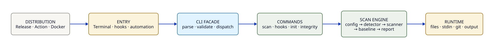
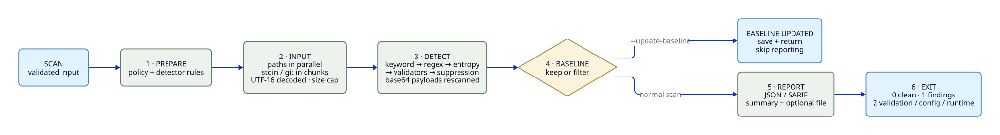
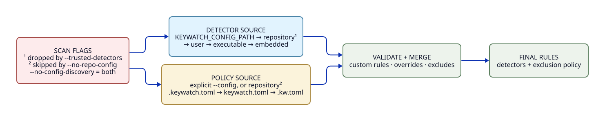

# KeyWatch

KeyWatch scans files, directories, and git repositories for secrets such as API keys, tokens, passwords, and private keys.
It runs as a command-line tool, as a git hook, as a GitHub Action, and as a container image.

## Install

Install with cargo:

```sh
cargo install key-watch
key-watch --version
```

Or download a binary from GitHub Releases, place it on your `PATH`, and make it executable:

```sh
mkdir -p ~/.local/bin
mv ~/Downloads/key-watch ~/.local/bin/key-watch
chmod +x ~/.local/bin/key-watch
~/.local/bin/key-watch --version
```

Building from source requires Rust 1.85 or later.

The command is `key-watch`.
To use the shorter aliases `keywatch` and `kw`, add this line to your shell configuration file:

```sh
eval "$(key-watch init bash)"   # or: zsh, fish, posix
```

## Scan from the command line

Scan a file, a directory, or standard input:

```sh
key-watch scan secrets.txt          # one file
key-watch scan .                    # a directory tree
cat secrets.txt | key-watch scan --stdin
```

Scan a git repository:

```sh
key-watch scan --staged             # only the lines staged for commit
key-watch scan --git-history        # every commit on every branch
key-watch scan --git-history --rev-range abc123..def456   # a commit range
```

Control the output:

```sh
key-watch scan . --verbose               # print the full JSON report
key-watch scan . --output report.json    # write the report to a file
key-watch scan . --format sarif --output report.sarif   # write SARIF to a file
```

By default, KeyWatch prints one line per finding with the file, line number, and a redacted preview.
Reports never contain the full matched text unless you pass `--show-secrets`.

### Scan options

| Option                    | Purpose                                                                                                           |
| ------------------------- | ----------------------------------------------------------------------------------------------------------------- |
| `--exclude <patterns>`    | Skip paths that match these comma-separated glob patterns                                                         |
| `--exit-mode <mode>`      | `strict` fails on any finding (default), `critical` fails only on HIGH or CRITICAL findings, `always` never fails |
| `--fail-on-unscannable`   | Fail when a file or directory could not be read; applies in `strict` exit mode and not with `--update-baseline`   |
| `--baseline <path>`       | Use a specific baseline file                                                                                      |
| `--no-baseline-discovery` | Do not look for a baseline file automatically                                                                     |
| `--update-baseline`       | Record the current findings in the baseline instead of reporting them                                             |
| `--prune-baseline`        | With `--update-baseline`, also remove baseline entries that no longer match anything                              |
| `--config <path>`         | Use a specific `.keywatch.toml` configuration file                                                                |
| `--trusted-detectors`     | Ignore a `detectors.toml` supplied by the scanned repository; use only built-in or operator rules                 |
| `--no-repo-config`        | Do not look for `.keywatch.toml` in the scanned tree; an explicit `--config` still loads                          |
| `--no-config-discovery`   | Shorthand for `--trusted-detectors` plus `--no-repo-config`; the installed hooks pass it                          |
| `--show-secrets`          | Include the full matched text in reports                                                                          |
| `--max-file-size <MB>`    | Skip files larger than this size and report them as unscannable                                                   |

Notes:

- Lock files such as `Cargo.lock`, `package-lock.json`, `pnpm-lock.yaml`, and `yarn.lock` are always skipped.
  They contain checksums, not credentials.
- `--staged` reads the content you staged with `git add`, not the files on disk.
  A secret that is staged but already removed from the working copy is still found.
  A secret whose lines were staged in separate commits can span change hunks the diff never shows together; run `key-watch scan .` on the tree to catch that case.
- `--git-history` scans every branch and tag.
  Use `--rev-range` to scan only a range of commits.
- A scan path that does not exist, is a symbolic link, or cannot be read is an error.
  The scan never reports a clean result for input it could not read.
- Files that start with a UTF-16 byte-order mark are decoded and scanned.
  Other files that contain NUL bytes are treated as binary and reported as unscannable.
- Base64 runs of 24 or more characters are decoded, and the decoded text is scanned as well.
  An encoded credential is reported at the line that contains it.
- GitHub tokens are checked against their built-in checksum, so lookalike strings do not appear in results.

### Exit codes

| Code | Meaning                                                           |
| ---- | ----------------------------------------------------------------- |
| 0    | No secrets found, or `--exit-mode always`                         |
| 1    | Secrets found, or an unreadable file with `--fail-on-unscannable` |
| 2    | Invalid input, configuration error, or runtime error              |

## Git hooks

KeyWatch installs two git hooks:

- The **pre-commit** hook scans the lines you staged.
  A secret in staged content blocks the commit.
  Findings in lines you did not change never block a commit.
- The **pre-push** hook scans the commits you are about to push.
  It runs in `critical` exit mode, so HIGH and CRITICAL findings block the push; MEDIUM and LOW findings are reported but do not block.
  Uncommitted files never block a push.

Install and remove hooks inside a repository:

```sh
key-watch hook install pre-commit
key-watch hook install pre-push
key-watch hook uninstall pre-commit
key-watch hook uninstall pre-push
```

Add `--global` to install or remove a hook for every repository on the machine:

```sh
key-watch hook install pre-commit --global
key-watch hook uninstall pre-commit --global
```

### Hook options

| Option                   | Applies to | Purpose                                     |
| ------------------------ | ---------- | ------------------------------------------- |
| `--exclude <patterns>`   | pre-commit | Skip staged paths that match these patterns |
| `--allowed-repos <urls>` | pre-push   | Allow pushes only to these repositories     |
| `--blocked-repos <urls>` | pre-push   | Block pushes to these repositories          |

### How hooks behave

- Hooks always use the built-in detector rules.
  A repository cannot weaken its own scan by committing a modified detector file.
- Hooks respect a committed baseline file and `keywatch:ignore` markers.
- KeyWatch refuses to overwrite or remove a hook file it did not install.
- The first push of a branch scans the full history of that branch, because every commit on it is new to the remote.
  If that push reports old findings, record them in the baseline first.
- A global install sets `core.hooksPath` in your git configuration.
  Git then ignores each repository's own `.git/hooks` scripts.
  To keep a repository's own hooks instead, run `git config core.hooksPath .git/hooks` inside that repository.
  The KeyWatch hook then no longer runs there.

## Baselines

A baseline records findings you have reviewed and accepted, so later scans report only new findings.
The baseline file stores fingerprints of the findings, never the secrets themselves, and is safe to commit.

```sh
# Record the current findings
key-watch scan . --update-baseline

# Later scans report only new findings
key-watch scan .
```

KeyWatch finds a committed `.keywatch-baseline.json` automatically.
You do not need to pass `--baseline` on every scan.

## Ignore a single line

Add `keywatch:ignore` to a line to suppress findings on that line:

```sh
password = 'known-test-password' # keywatch:ignore
```

## Configuration

Place a `.keywatch.toml` file in the repository root to add rules, disable detectors, or exclude paths:

```toml
exclude = ["target/**"]

[[rules]]
name = "InternalToken"
pattern = "INT_[A-Za-z0-9]{32}"
finding_type = "Internal Token"
severity = "HIGH"

[overrides.EmailDetector]
enabled = false
```

Unknown keys in the configuration file are rejected, so a misspelled key cannot silently weaken a scan.

## GitHub Action

```yaml
name: Secret scan

on:
  pull_request:
  push:

permissions:
  contents: read

jobs:
  keywatch:
    runs-on: ubuntu-latest
    steps:
      - uses: actions/checkout@v7
      - id: keywatch
        uses: pixincreate/KeyWatch@v2
        with:
          paths: "."
          exit-mode: strict
```

The Action installs a released KeyWatch binary, verifies its checksum, and writes a JSON report.
It supports Linux x64 and macOS runners.
Pin an exact release tag or commit SHA when you need a fixed version.

| Input       | Default                | Purpose                                                              |
| ----------- | ---------------------- | -------------------------------------------------------------------- |
| `version`   | Action release version | Exact KeyWatch release to install                                    |
| `paths`     | `.`                    | Space-separated paths or globs to scan                               |
| `args`      | empty                  | Extra scanner arguments; Action-managed options cannot be overridden |
| `exit-mode` | `strict`               | `strict`, `critical`, or `always`                                    |
| `output`    | temporary file         | Path for the JSON report                                             |
| `config`    | empty                  | Path to a trusted `.keywatch.toml`                                   |
| `verbose`   | `false`                | Deprecated; enabling it is rejected to keep secrets out of logs      |

The Action exposes `findings-count` and `exit-code` as step outputs.

## Container image

```sh
docker pull ghcr.io/pixincreate/keywatch:2
docker run --rm --volume "$PWD:/workspace:ro" ghcr.io/pixincreate/keywatch:2 scan .
```

Images are tagged `x.y.z`, `x.y`, `x`, and `latest`.
Use an exact version tag for reproducible results.
The image runs as a non-root user.

## Uninstall

If you installed with cargo:

```sh
cargo uninstall key-watch
```

If you installed a binary manually, delete it from your `PATH` directory:

```sh
rm -f ~/.local/bin/key-watch
```

In both cases, remove the `key-watch init` line from your shell configuration file if you added one.

## Architecture

KeyWatch is a single Rust binary.
`main.rs` starts the program and maps every validation, configuration, or runtime failure to exit code 2.
Scans exit with code 0 or 1.
Separate modules own detector loading, scanning, baselines, reports, and hooks.

### Modules and adapters



Green boxes are internal modules.
Blue boxes are entry and output boundaries.
Yellow boxes are external adapters such as git and the installed hook scripts, which call `key-watch scan` themselves.

### Scan pipeline



Path scans collect files and scan them in parallel.
Stdin and git-based scans stream their input in overlapping chunks.
`--update-baseline` writes the baseline instead of producing a report.

### Detector and configuration trust



Detector rules and repository configuration are separate systems.
External detector sources take precedence, and the compiled-in rules are the fallback.
Trusted scans ignore files supplied by the scanned repository but still honor explicit configuration and operator-supplied detector sources.

### Core data types

- **Detector** — one named rule: pattern, finding type, severity, optional keywords, entropy threshold, allowlist, and validator.
- **Finding** — one detected secret: file path, line number, finding type, severity, matched content, and the detector that produced it.
- **Severity** — `Critical`, `High`, `Medium`, `Low`.
- **KeywatchConfig** — parsed `.keywatch.toml`: custom rules, per-detector overrides, and exclude patterns.
- **Baseline** — versioned fingerprint entries that filter out known findings.
- **ScanMetadata** — files scanned, total lines, and skipped files, reported alongside findings.

The diagram sources are in `docs/architecture/*.d2`.
After editing them, run `scripts/render-diagrams.sh render` with D2 v0.7.1, or `scripts/render-diagrams.sh check` to detect stale images.

## Development

```sh
cargo build --release
cargo test
cargo fmt
cargo clippy
```

## License

KeyWatch is licensed under the GPL-3.0-only license.
See [LICENSE](LICENSE).
